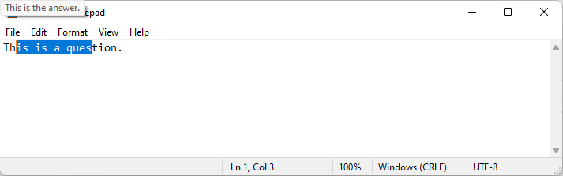

# Answer Finder

## Description:

Finds the question from the json and show it as a tooltip.

## Usage:

Run the script and choose the json file that contains the questions and answers. Copy a question (or a part of the question) to the clipboard and if you press `shift` the answer will show up in the top left corner as a tooltip.

## Hotkeys:

- `Shift`: finds the question and shows the answer as a tooltip
- `Esc`: Stops the script
- `F5`: Reloads the script

## In action:

